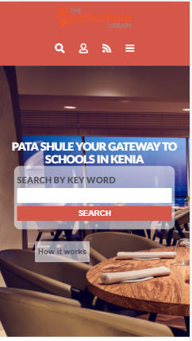
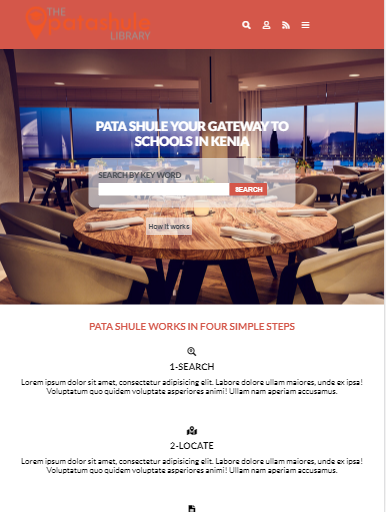
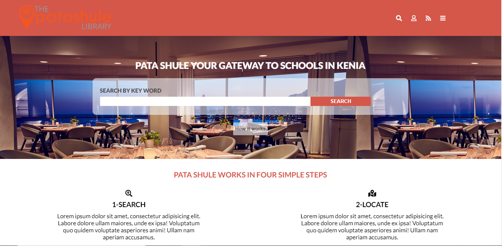

# Html_and_CSS_Capstone

> I am a Microverse student doing the HTML and CSS capstone project. I followed the design of the directory of schools [Patashule](https://www.behance.net/gallery/25563385/PatashuleKE) to make a website with different content but keeping the layout and colors from the original design.

- Mobile

 

- Tablet

 

- Desktop

 

## Built With

- HTML
- CSS

## Live Demo

- https://rawcdn.githack.com/julian3493/Microverse-HTML-Forms-Project/e769a6e389660c3b917892fdbbf5e4360fdbc476/signup.html

## Getting Started

To get a local copy up and running follow these simple example steps.

Clone the project repository by typing the command below

- git clone https://github.com/julian3493/Html_and_CSS_Capstone.git

After that enter on the directory of the cloned repository
- cd Microverse-HTML-Forms-Project

To see how it looks like open the signup.html file on your browser

## Authors

👤 **Julián**

- GitHub: [@julian3493](https://github.com/julian3493)
- Twitter: [@JulianR16893833](https://twitter.com/JulianR16893833)
- LinkedIn: [LinkedIn](https://www.linkedin.com/in/juli%C3%A1n-ricardo-ramos-arevalo-3868ba135/)

## 🤝 Contributing

Contributions, issues, and feature requests are welcome!

Feel free to check the [issues page](https://github.com/julian3493/Html_and_CSS_Capstone/issues).

## Show your support

Give a ⭐️ if you like this project!

## Acknowledgments

We thank all the sites below where we have found lots of meaningful content

- Intuit companies
- W3Schools